# Features

What Jidou does and how to use each capability.

---

## Show library

Jidou maintains a local library of TV shows and anime linked to [TMDB](https://www.themoviedb.org/). Each show stores its TMDB metadata, a local filesystem path, a content type, and the full episode list.

**Adding a show:**
- Go to **Shows → Add Show** and search by title.
- Or browse **Trending** for currently popular titles, or add directly from [Discover](#discover).
- Full TMDB details (genres, external IDs, episode groups) are fetched on creation — not just the sparse fields shown in a search result card — and episodes are synced automatically.

The Shows page remembers your sort order and filter selections (content type, status, genre, language, upcoming, minimum rating) across navigation, not just page reloads.

**Content type inference:**
New shows are classified as `tv`, `anime`, or `movie` using TMDB genre and language metadata. The inferred type controls which local path the routed files land in. You can override it from the Show Detail page.

**Syncing episodes:**
Use **Sync Episodes** on the Show Detail page (or `POST /api/shows/{id}/sync-episodes`) to pull the latest episode data from TMDB. Useful when a show has aired new episodes since you added it.

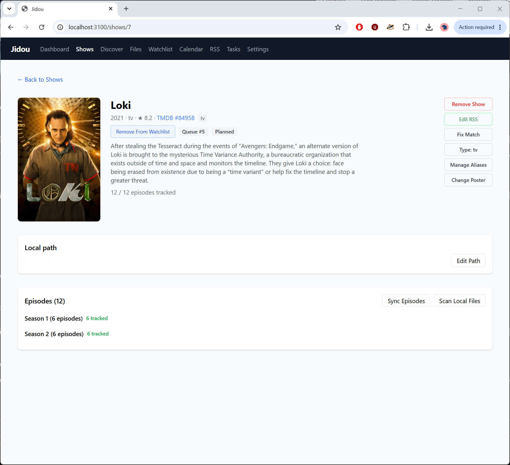

**Show rematch:**
If a show was linked to the wrong TMDB entry, use **Rematch Show** to re-link it. All episode data is replaced; existing file tracking is preserved where episode numbers align, and orphaned records are created for episodes that no longer exist.

**Poster selection:** Use **Change Poster** on the Show Detail page to pick, independently, which TMDB poster (English or textless) is used on the Shows-page grid card versus the Show Details header. The choice is stored separately from TMDB's own `poster_path` so a later metadata resync never silently overwrites it. All poster and backdrop images load through Jidou's own image cache (see [Image caching](#image-caching)) rather than hotlinking `image.tmdb.org`.

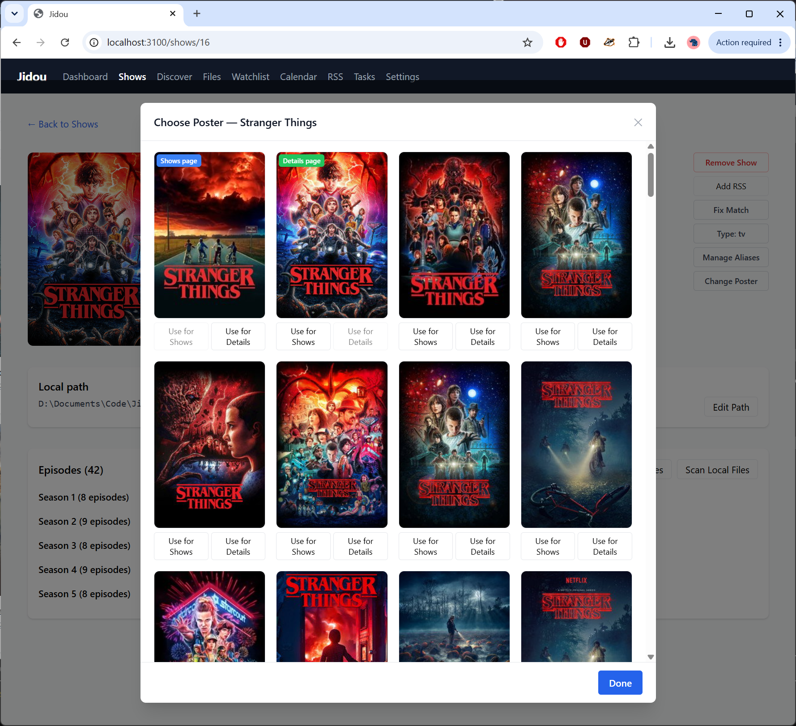

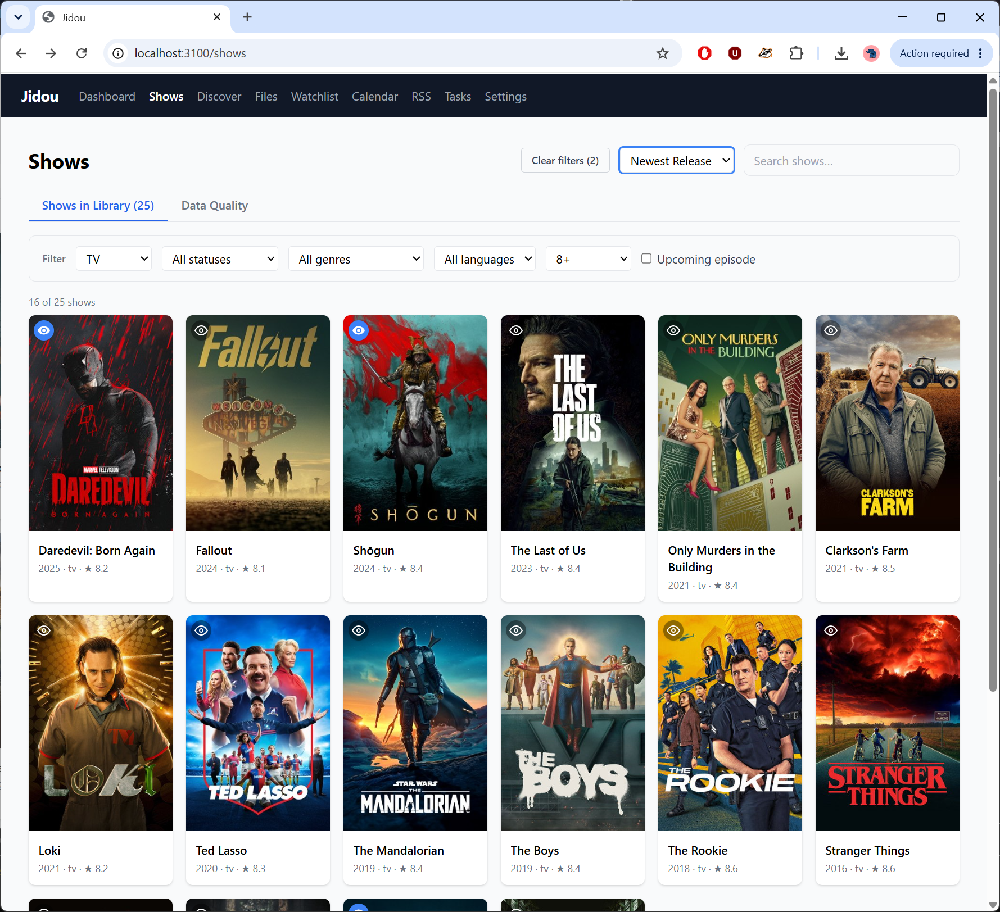

---

## SFTP scanning

Jidou scans one or more remote SFTP directories for new media files and creates records for anything it hasn't seen before. Scanning is read-only — no files are moved or deleted on the remote server.

Scanning only lists the top level of each configured remote path directly; a full recursive listing only happens once per directory, the first time that directory is seen (see [Architecture](architecture.md#sftp-scan-design--shallow-listing-plus-lazy-deep-walk)). A first scan after adding a new remote path or after the one-time seed baseline walks every existing directory once; every scan after that is fast, since previously-seen directories are skipped without any SFTP round trip. If your source directories are ever appended to after being fully populated (uncommon for seedbox/torrent-client downloads, but possible for a manually-managed share), new files added to an already-scanned directory will not be picked up — scan that directory explicitly via a fresh remote path, or re-run the seed baseline.

**Configuration:** Set `SFTP_HOST`, `SFTP_USERNAME`, `SFTP_PASSWORD` (or `SFTP_KEY_FILE`), and `SFTP_REMOTE_PATHS` in `.env`.

**Triggering a scan:**
- Tasks page → **Scan**, or
- `POST /api/tasks/trigger` with `{"task_type": "scan"}`

Files discovered by the scan appear on the Files page with status `discovered`.

---

## File downloading

The download task transfers `discovered` (and `error`) files from the remote SFTP server to the local staging path (`LOCAL_STAGING_PATH`).

**Triggering a download:**
- Tasks page → **Download**, or
- `POST /api/tasks/trigger` with `{"task_type": "download"}`

Downloads are parallelised across `SFTP_MAX_WORKERS` threads (default 8). Progress is streamed to the browser in real time via WebSocket.

---

## Episode matching

After a file is downloaded to staging, the match task attempts to link it to the correct show and episode. Two strategies are used in order:

1. **Heuristic** — regex extraction of `S01E02` or `1x02` patterns from the filename, cross-referenced against show titles and aliases in the database.
2. **LLM** — if the heuristic fails or returns ambiguous results, the file is sent to the configured LLM provider with the show title, filename, and episode list.

If both fail, the file is marked `unmatched` for manual review.

**Manual match:** Use the **Resolve** button on the Files page to search TMDB and pick the correct show/episode manually.

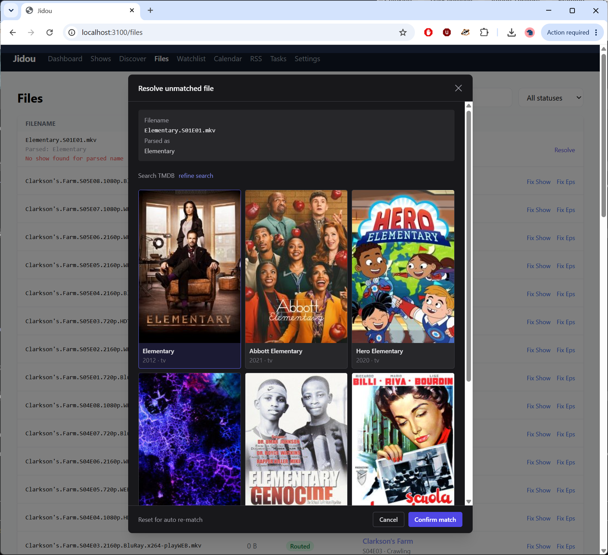

**Fixing an already-matched file:** On the Show Detail episode list, **Fix Show**/**Fix Eps** and the per-episode rematch flow let you re-open matching for a file that landed on the wrong show or episode without waiting for a full re-scan — this covers both download-backed files (`begin-rematch`) and path-imported episodes with no backing file (`assign-import`).

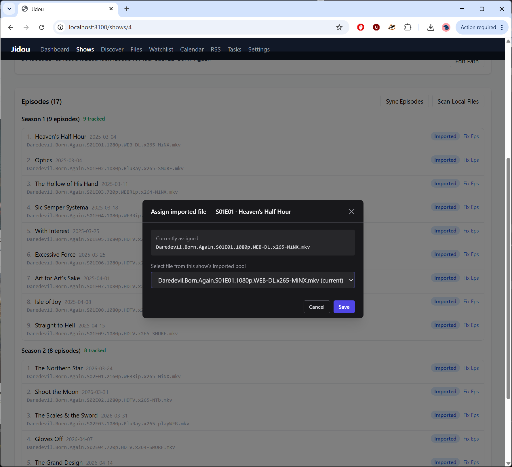

**Linking a file directly to an episode:** On an untracked episode row in the Show Detail episode list, use **Match File** instead of routing through bulk text-file import. Two modes: pick an existing unmatched file already scoped to the show, or type a path Jidou hasn't seen yet — a content-type picker (mirroring **Edit Path**) builds the full container path from the show/season/filename portion you type, previews it, and validates the file exists on disk before linking (`POST /shows/{show_id}/episodes/{episode_id}/link-file`). Manually linked files are tracked with `tracked_source="import"`, the same as bulk path-import, so they participate in the same reassignment flow.

**Scanning a show's own directory:** **Scan Local Files** on the Show Detail page walks the show's own local path on disk and runs every file it finds through the same matching pipeline bulk path-import uses — useful for picking up stragglers a prior import missed, or an existing library that predates Jidou. It's read-only: results are shown as `matched` (untracked episode, ready to confirm), `unmatched` (no episode resolved), or `conflict` (the proposed episode is already tracked by a different file), with an editable per-row episode picker and a bulk **Confirm All Matched** action. Files already recorded against the show (a prior import or download) are skipped automatically. If a filename or the show's own directory name contains a legacy Latin-1/cp1252 byte instead of proper UTF-8 — common in libraries authored by older Windows/NAS tooling — Jidou recovers the actual accented character for display and still links the file correctly; see [Matching Pipeline](matching-pipeline.md#filenames-and-directory-names-with-non-utf-8-bytes).

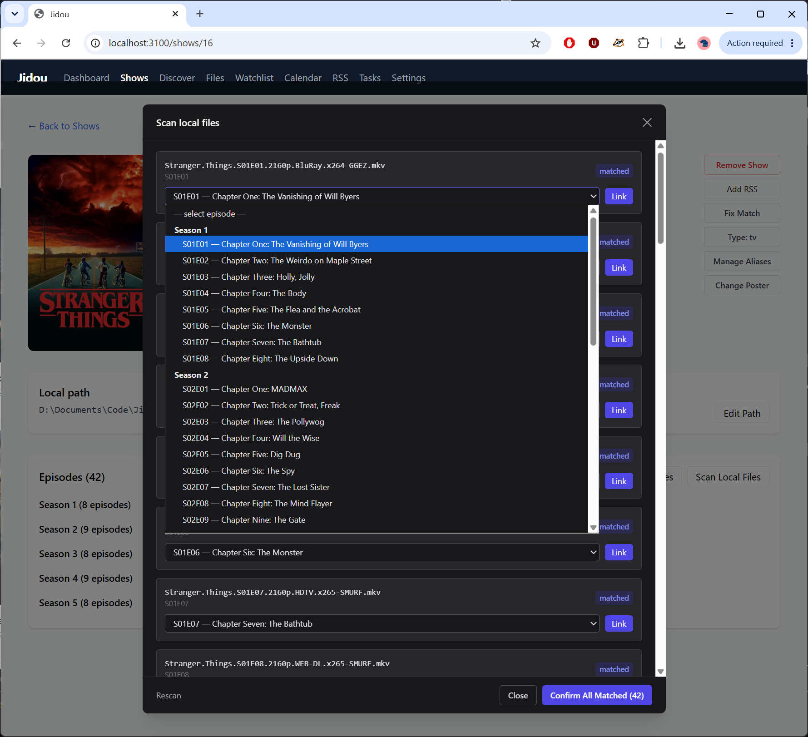

**Re-running the match:**
- Tasks page → **Match**, or
- `POST /api/tasks/trigger` with `{"task_type": "match"}`

Only `downloaded` and `unmatched` files are processed.

---

## File routing

Routing moves a `matched` file from the staging area to its final library path, organised by content type and season:

```
LOCAL_TV_PATH/Show Name/Season 01/filename.mkv
LOCAL_ANIME_PATH/Show Name/Season 01/filename.mkv
LOCAL_MOVIE_PATH/Movie Name/filename.mkv
```

**Triggering routing:**
- Tasks page → **Route**, or
- `POST /api/tasks/trigger` with `{"task_type": "route"}`

All `matched` files are processed. After routing, the file status becomes `routed` and the episode's `file_tracked` flag is set.

---

## Excluding non-media files from matching

Some SFTP sources mix genuinely non-TV/movie files into otherwise normal downloads — documentaries, theatre recordings, workout videos. These still need to be discovered and downloaded (so they're never mistaken for new content and re-fetched), but should never enter parse/match/route.

- **Configured noscan paths** — set `SFTP_NOSCAN_PATHS` in `.env` to one or more remote paths (parallel to `SFTP_REMOTE_PATHS`). Files under a noscan path are tagged at discovery time and routed straight to a terminal `ignored` status once downloaded, instead of `downloaded`.
- **Manual ignore** — for a stray file a noscan path didn't catch, use the **Ignore** action on the Files page (or `POST /api/files/{id}/ignore`) on any `unmatched` or `error` file. The record is kept, not deleted, so the file is never re-downloaded.

---

## Full sync pipeline

The `sync` task runs scan → download → match → route in sequence as a single pipeline. Use it for unattended automation.

```bash
POST /api/tasks/trigger
{"task_type": "sync"}
```

All tasks support a `dry_run` flag:
```bash
{"task_type": "sync", "dry_run": true}
```
Dry run performs all validation and planning but does not move any files or write episode tracking data.

---

## Path import

Import an existing local media directory into Jidou without re-downloading anything. The import task reads a directory tree, matches each file to a TMDB show and episode, and creates records as if the files had been routed normally.

**Import from the UI:** Go to **Data → Import → Path Import** and paste the root path.

**Import via API:**
```bash
POST /api/import/text
Content-Type: text/plain

/data/media/tv/Breaking Bad
/data/media/anime/Attack on Titan
```

---

## Watchlist

Track your viewing status for each show independently of the file library.

| Status | Description |
|--------|-------------|
| `planned` | Intend to watch |
| `watching` | Currently watching |
| `completed` | Finished |
| `on_hold` | Paused |
| `dropped` | Abandoned |

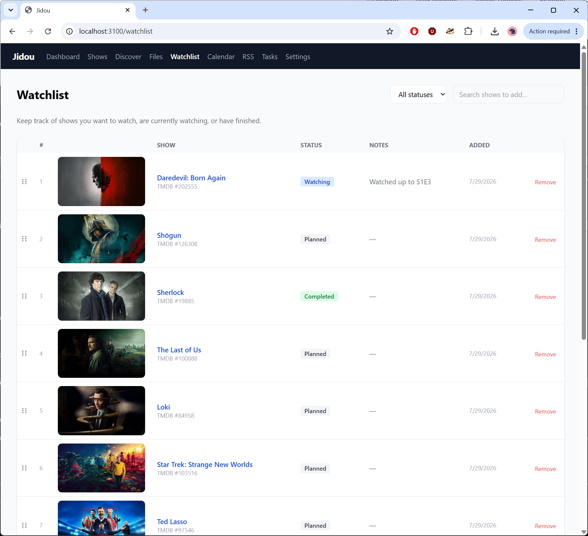

Shows can be added to the watchlist from the Show Detail page — a color-coded Add/Remove toggle sits inline in the metadata line, alongside a "Queue #N" pill and a status pill (each opens a dropdown to change position/status without leaving the page). The Watchlist page supports drag-to-reorder for prioritising your queue.

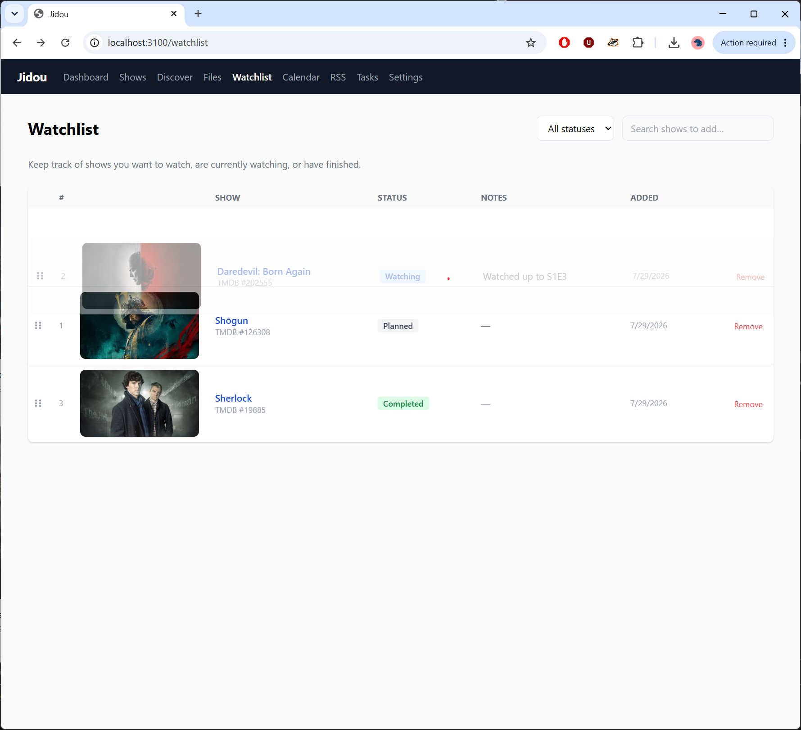

---

## Discover

The **Discover** page (nav bar, between Shows and Files) surfaces shows and movies not yet in your library: `GET /api/shows/discover` seeds recommendations from your most recently updated `watching`/`completed` watchlist shows, dedupes them, and fills out the feed with trending TV/movies when seeded results are thin — or falls back to plain trending if your watchlist has no watching/completed entries at all. Each card shows which watchlist shows it was recommended because of (`seeded_from`), and clicking a card opens a detail modal with the overview, rating, and a "View on TMDB" link.

**Add + Watchlist:** one click on a Discover card creates the show and adds it to your watchlist (plus an RSS stub, if RSS is configured) in one step.

The feed is cached 24h and keyed to your current watchlist seed set, so adding/removing a watching show invalidates the cache immediately rather than waiting out the TTL.

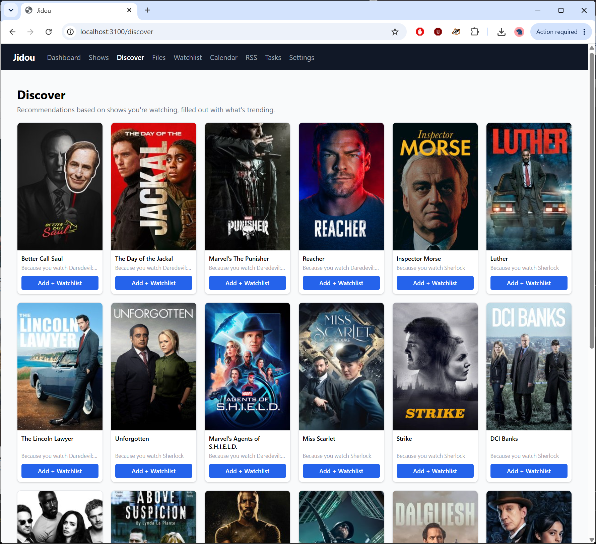

---

## RSS feed integration

Jidou can two-way sync with a Deluge-compatible RSS feed config (YaRSS2 format): **feeds** are the RSS source URLs, **subscriptions** link a feed to a show with optional include/exclude regex filters.

- **Import** (`rss_import` task) — downloads the remote YaRSS2 config and reconciles it into Jidou's database: existing subscriptions are fuzzy-linked to shows, unmatched entries become inactive stubs you can link manually.
- **Publish** (`rss_publish` task) — composes Jidou's current subscription state back into a YaRSS2 config and uploads it. Optionally stops Deluge over SSH before the upload and restarts it after, with configurable delays, so the client never reads a half-written config.
- Every publish keeps a **snapshot** of the config it wrote, viewable from the RSS page for diffing against a previous publish.
- The **Recommendations** tab flags subscriptions worth reviewing (e.g. stale or unlinked). **Suggest regex** asks the configured LLM to draft an include/exclude filter from a show's title.

Configure feeds and subscriptions from the **RSS** page. The `RSS_CONFIG_REMOTE_PATH` env var controls where the generated config is written on the SFTP server.

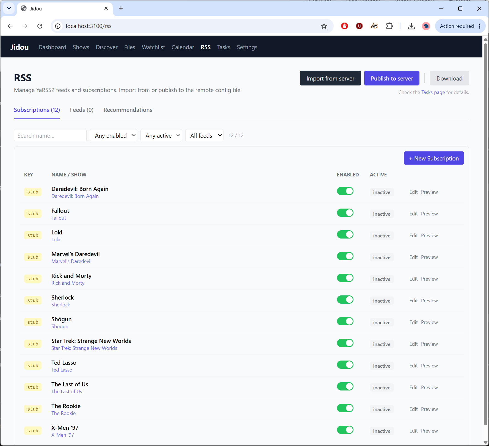
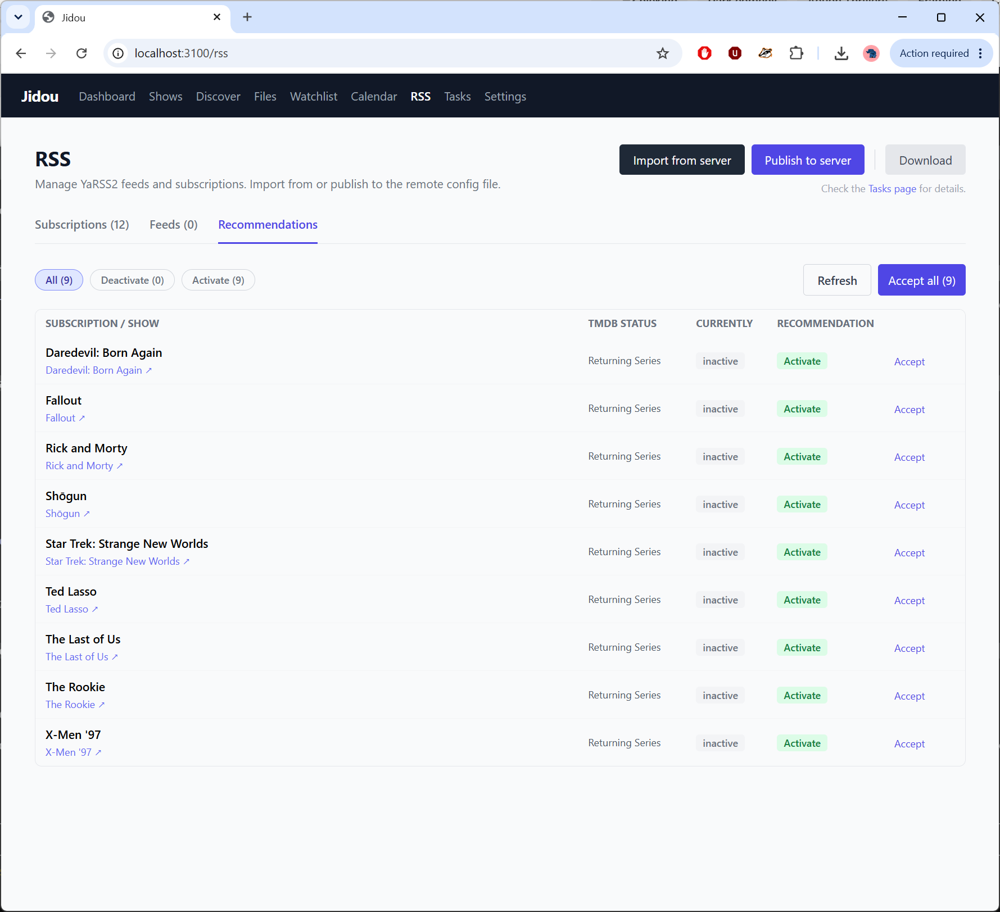
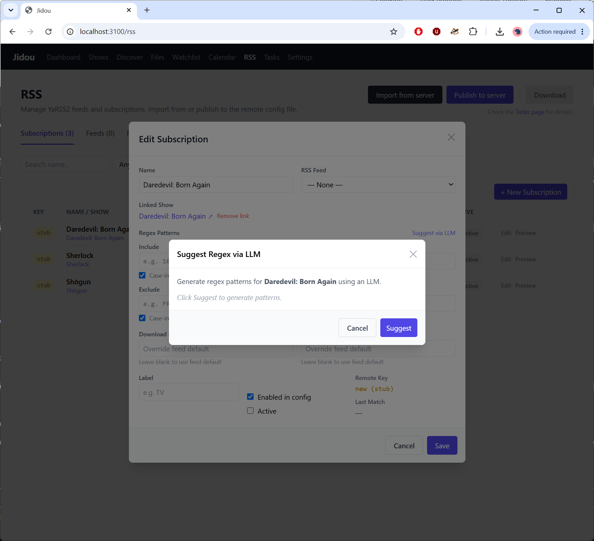

---

## Dashboard

The Dashboard is the landing page: a pipeline-status donut, a file-ingestion chart for the last 30 days, and three "Recently Added" carousels — shows, movies, and episodes — each independently sortable (`tracked` vs. `release` date) and filterable by content type or genre (the Shows carousel excludes movies; the Movies carousel has its own dedicated `GET /api/dashboard/recent-movies` endpoint), and independently toggleable off from Settings if you don't want them.

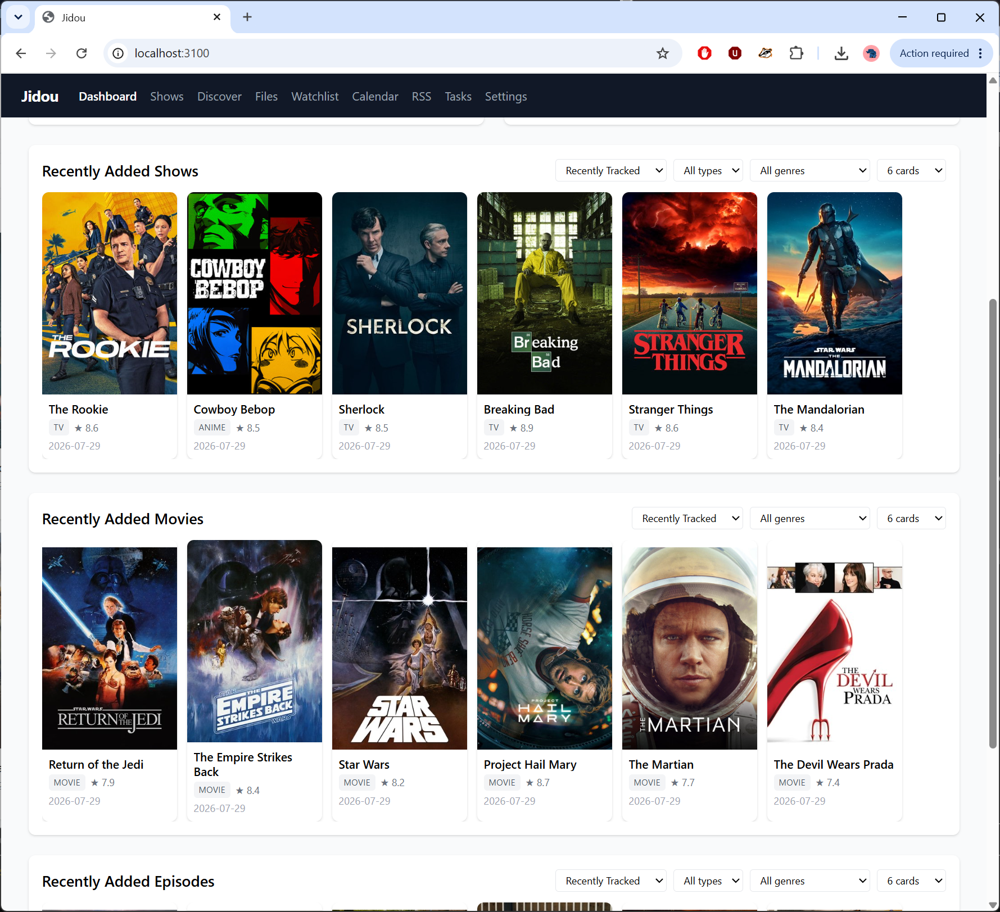

---

## Airing calendar

An optional calendar page (toggle in Settings) showing episodes airing in a date range across your whole library, each marked `tracked`, `missing`, or `upcoming` relative to today.

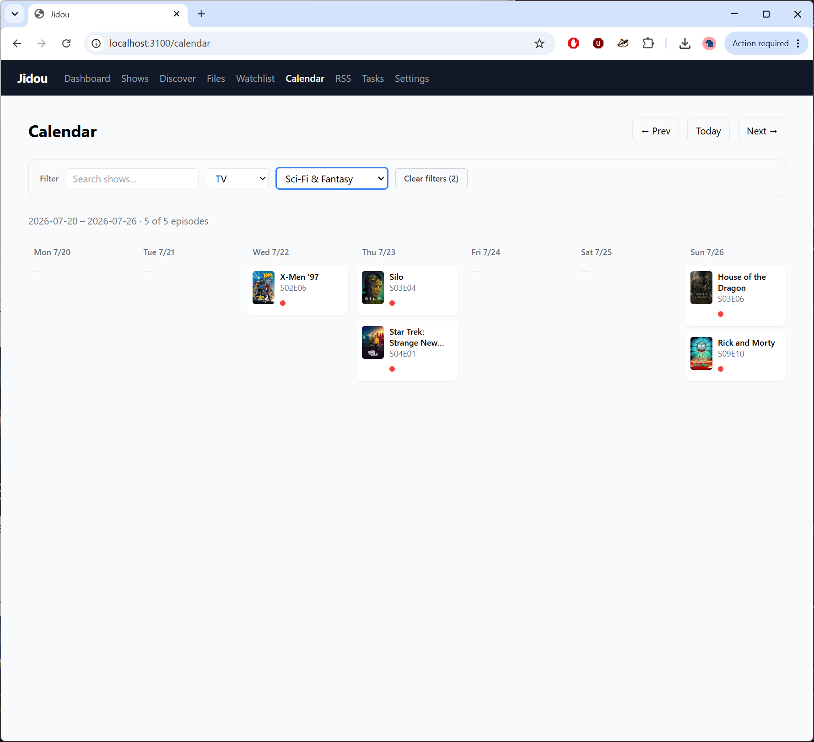

---

## Settings

The **Settings** page has three groups:
- **Services** — connection tests and status for TMDB, SFTP, Redis, and the LLM provider, plus the API docs link and API key status.
- **Feature toggles** — enable/disable the Dashboard's Recently Added Episodes and Recently Added Movies carousels, the airing calendar page, and whether adult-flagged content is shown at all (enforced server-side, not just hidden in the UI).
- **Show Metadata Backfill** — one-click trigger (dry-run supported) for the `backfill_show_metadata` task, which re-fetches full TMDB details for any show that's missing genre/external-ID data — see [Show library](#show-library).
- Config values are read-only here (edit `.env` and restart to change them); the toggles above are the only settings persisted to the database (`app_settings` table) and changeable at runtime.

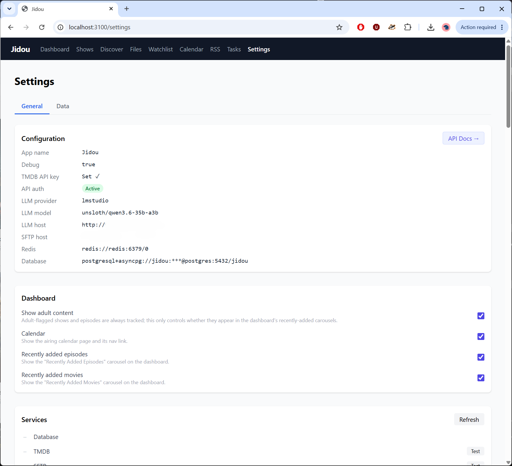

---

## One-time SFTP baseline (seed)

If you're onboarding an existing library where the remote SFTP directories already contain files you don't want re-downloaded, run the **seed** task once (from the Settings page) to mark every currently-visible remote file as `seeded` instead of `discovered` — it will never be picked up by a scan or download. Seeding also backfills the scan's directory-known markers (see [SFTP scanning](#sftp-scanning)) so the first real scan afterward doesn't re-walk the whole library.

---

## Export and import

Export your entire library to a portable YAML file:

```bash
GET /api/export/database
```

Restore from a backup:

```bash
POST /api/import/database
Content-Type: multipart/form-data
file=@jidou-backup.yaml
```

The export captures shows, episodes, file records, tracking state, watchlist entries, and RSS subscriptions.

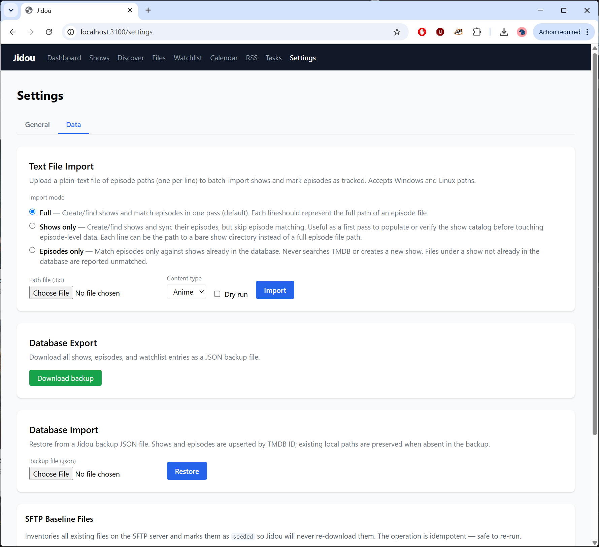

---

## Data Quality

The **Data** tab on the Shows page surfaces issues that require human attention.

### Per-show checks

Each show card shows an amber badge when any check fails:

| Check | Condition |
|-------|-----------|
| Missing local path | `show.local_path` is null |
| Unset content type | `show.content_type` is null |
| No episodes synced | `episode_count == 0` (TV/anime only) |
| Orphaned records | Show has unresolved orphaned tracking records |

### Orphaned tracking records

When a show is rematched to a new TMDB entry, episodes from the old entry that had confirmed tracking data but have no equivalent in the new entry become **orphaned tracking records**.

Resolve them from the Data Quality tab by linking each orphan to the correct episode in the new episode list, or dismiss them if the old tracking data is no longer relevant.

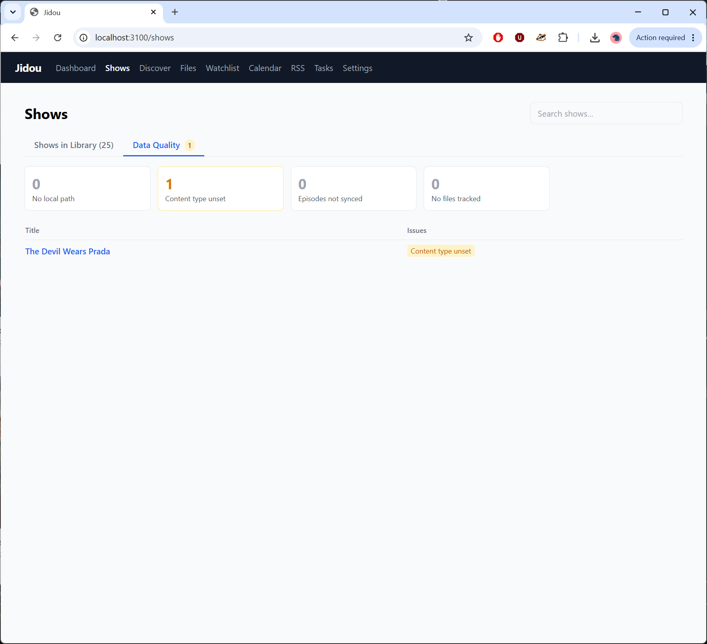

---

## Real-time progress

Every background task streams progress to the browser via WebSocket. The Tasks page shows live progress bars, current file being processed, and a full per-item event log — every file or directory processed emits an event, success or failure, for every task type (scan, download, match, route, sync, import, backfill_show_metadata).

The Tasks page list has two independent size controls: **Per page** controls how many task cards are fetched per page; **Max records** caps the total number of tasks reachable across all pages combined (useful for keeping a long-running instance's task history browsable without paging through everything ever run).

The WebSocket endpoint is `ws://host/ws` — the frontend connects automatically and reconnects with exponential backoff on disconnection.

---

## Image caching

Every poster and backdrop the UI shows loads through `GET /api/images/{size}/{filename}` — Jidou's own backend — rather than the frontend linking to `image.tmdb.org` directly. On a cache miss the backend fetches from TMDB, writes the bytes to disk, and serves from there on every subsequent request. This route is intentionally unauthenticated (a plain `` tag can't send `X-API-Key`, and the images themselves aren't sensitive).

Image fetches use their own rate limit (`IMAGE_RATE_LIMIT_PER_SECOND`, default 5/s), separate from the stricter TMDB metadata rate limit — `image.tmdb.org` is a different host, so poster loading no longer queues up behind an in-progress sync. A daily background task purges cached files past `IMAGE_CACHE_RETENTION_DAYS` (default 180); set `IMAGE_CACHE_EXPIRATION_ENABLED=false` to keep cached images indefinitely.

---

## API authentication

By default all API endpoints are open (suitable for isolated home network deployments). To enable authentication, set `JIDOU_API_KEY` in `.env`. All requests must then include:

```
X-API-Key: your_key
```

When using the Docker Compose stack, nginx injects this header automatically — the browser never needs to know the key. For direct API access (curl, scripts), include the header explicitly.

See [Setup](setup.md#api-authentication) for key generation instructions.
